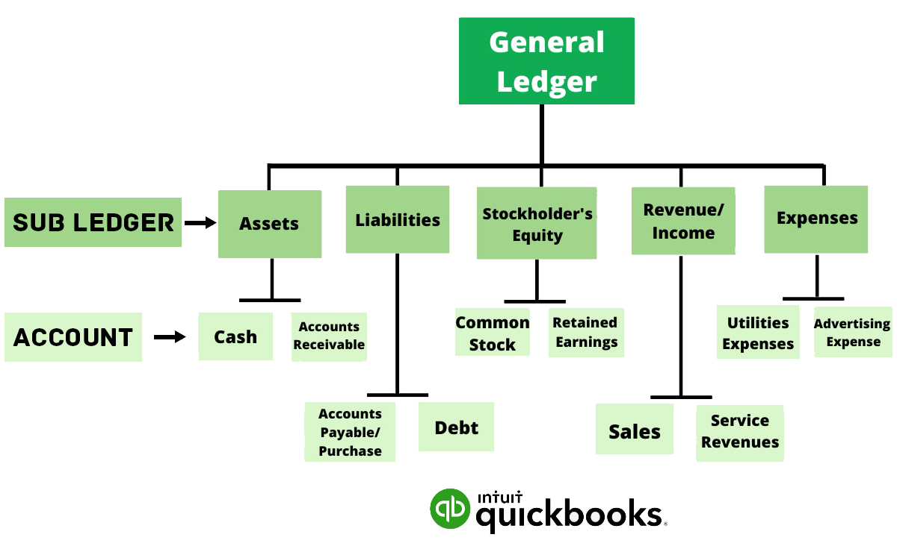
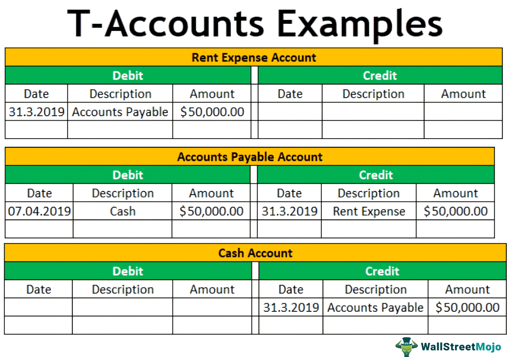
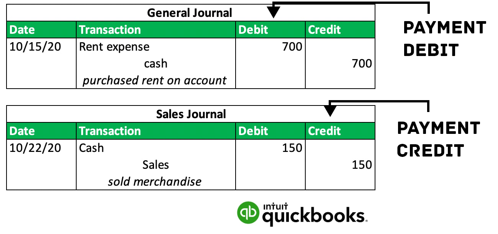

# **Tugas Besar Pemrograman Berbasis Object** _Double-Entry Accounting General Ledger_

# **Cara Kerja**

## General Ledger
General ledger/buku besar adalah catatan akuntansi yang mengkompilasi setiap transaksi keuangan perusahaan untuk memberikan entri yang akurat untuk laporan keuangan.

General Ledger memiliki catatan transaksi keuangan secara umum, dan tediri dari berbagai Sub ledger

## Subledger
Subsidiary Ledger atau Buku Besar Pembantu adalah buku yang berisi catatan keuangan yang lebih detail dan spesifik mengenai transaksi tertentu. 

Subledger adalah jenis ledger yang lebih spesifik dan berisikan berbagai akun serta fokus pada satu area tertentu seperti akun  asset, kewajiban(liabilities), ekuitas(Equity), pendapatan(Revenue) dan pengeluaran(expense). Subledger membantu memisahkan transaksi keuangan untuk memudahkan manajemen dan pelacakan.

   

## Account
Akun merupakan alat akuntansi yang digunakan untuk mencatat transaksi keuangan yang mengakibatkan perubahan asset, kewajiban(liabilities), ekuitas(Equity), pendapatan(Revenue) dan pengeluaran(expense). 

Account berisikan payment debit dan credit
      

## Journal Entry
Journal Entry adalah catatan kronologis transaksi aktifitas bisnis perusahaan.  

Journal Entry berisikan tanggal beserta payment debit/credit yang akan di dimasukkan ke account

## Payment Credit dan Payment Debit
Payment Credit merepresentasikan darimana economic benefit datang, sedangkan Payment Debit merepresentasikan kemana economic benefit pergi. Detailnya lebih baik tidak dijelaskan karena panjang dan itu urusan orang Accountant.

## Driver
Ini adalah kelas yang berfungsi sebagai tampilan antarmuka User dan Software.

      
# _**On Construction**_
# **Class Diagram**
  

# **Class**
## **Yuuka**
>Driver to control the entire thing

**Method**
+ inputInvoice()
+ deleteInvoice()
+ Initialize generalLedger()
+ createAcc()
+ createSubledger()
+ createNewFiscalYear()
+ printTAccount()
+ printBalanceSheet()
+ printInvoice()

## **Invoice** 
>this is huh

**Variable**
- JENumber: int
- date : date
- desc : String
- dr : paymentDebit[ ]
- cr : paymentCredit[ ]
- amount : double

 **Method**
+ Invoice()
+ input()
+ setJENumber(int JENumber)
+ getJENumber:(): int
+ setDr(double amount)
+ setCr(double amount)
+ getDr(): double
+ getCr(): double

## **Account**
>for bla

**Variable**
- accName: String
- totalDebit : double
- totalCredit : double
- invoices : Invoice[ ]

**Method**
+ Account(String accName)
+ reset()
+ setAccName(String accName)
+ getAccName() : String
+ addDebit(Double amount)
+ addCredit(Double amount)
+ reduceDebit(Double amount)
+ reduceCredit(Double amount)
+ addInvoice(Invoice invoice)

## **_Payment_**
>for huh

**Variable**
- payer: Account
- receiver : Account
- amount : double

**Method**
+ Payment(Account payer, Account receiver)
+ setPayer(Account payer)
+ setReceiver( Account receiver)
+ getPayer() : Account 
+ getReceiver() : Account 
  

### **paymentCredit**
>for huh

**Method**
+ paymentCredit(double amount)
+ setCredit(double amount)
+ getCredit(): double  
 

### **paymentDebit**
>for huh

**Method**
+ paymentDebit(double amount)
+ setDebit(double amount)
+ getDebit(): double  
 

## **_Ledger_**
>for huh

**Variable**
- ledgerName: String
- totalDebit : double
- totalCredit : double

**Method**
+ Account(String ledgerName)
+ reset()
+ setAccName(String ledgerName)
+ getAccName() : String
+ addDebit(Double amount)
+ addCredit(Double amount)
+ reduceDebit(Double amount)
+ reduceCredit(Double amount)
+ setLedgerName(String ledgerName)
+ getLedgerName() : String

### **generalLedger**
>for huh

**Variable**
- subledger : Ledger[ ] 

**Method**
+ generalLedger(String ledgerName)

 

### **subLedger**
>for huh

**Variable**
- account : Account[ ] 
  
**Method**
+ Subledger(String ledgerName)
+ addInvoice(Invoice invoice)